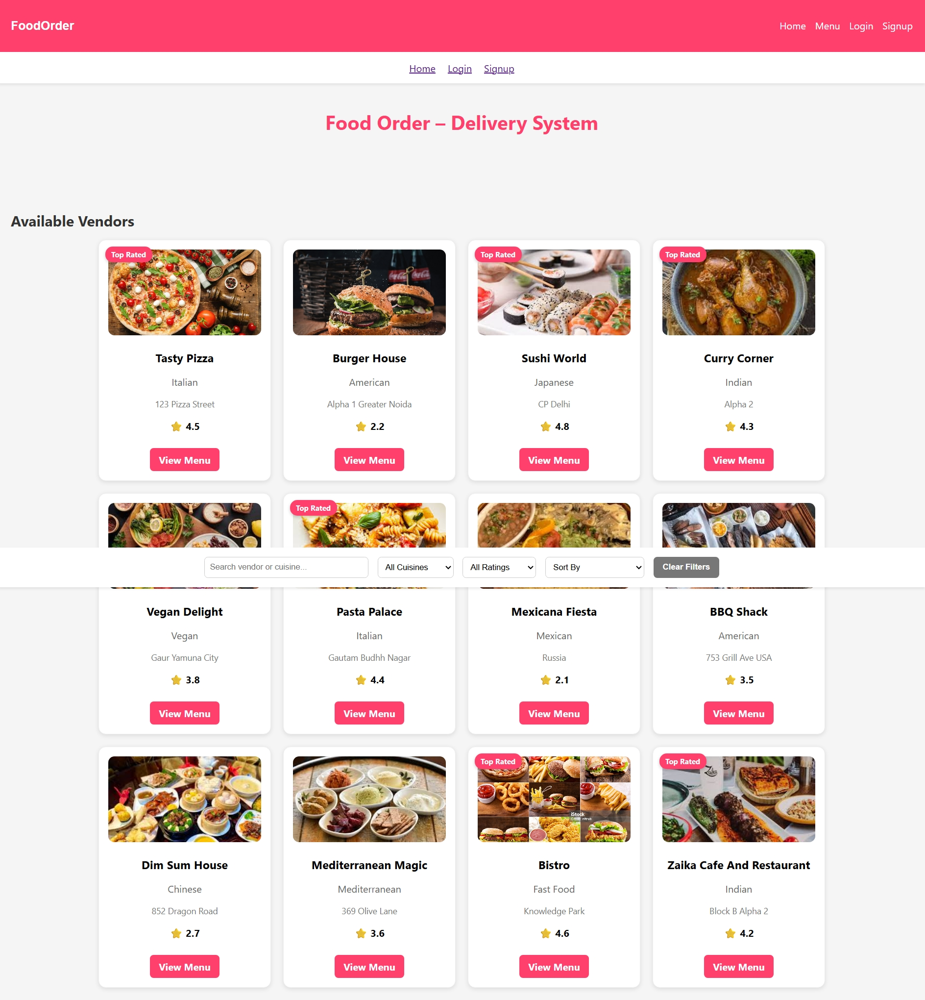
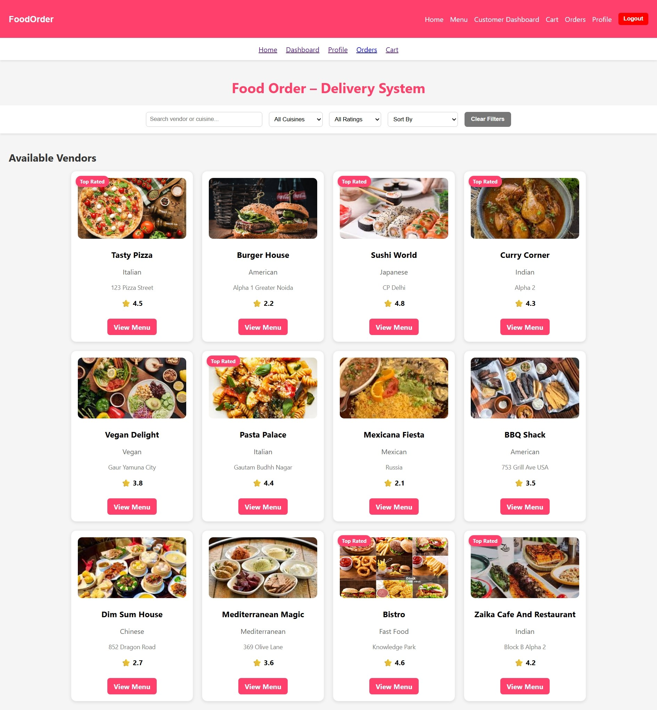
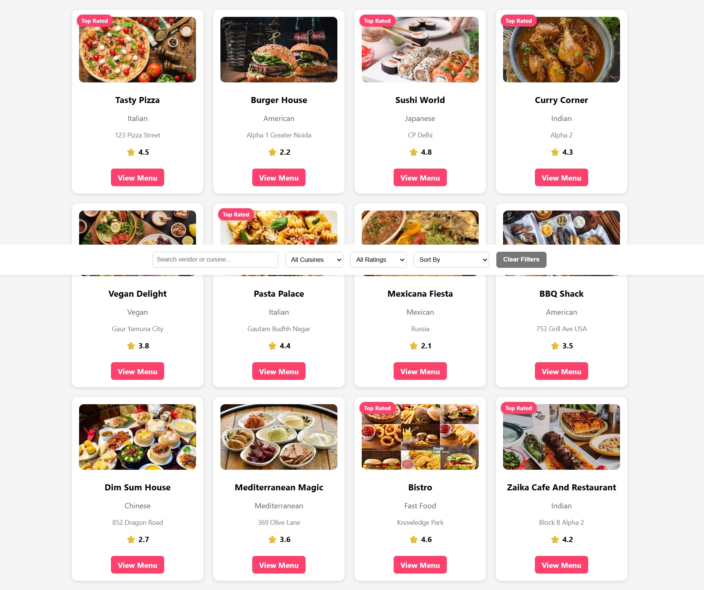
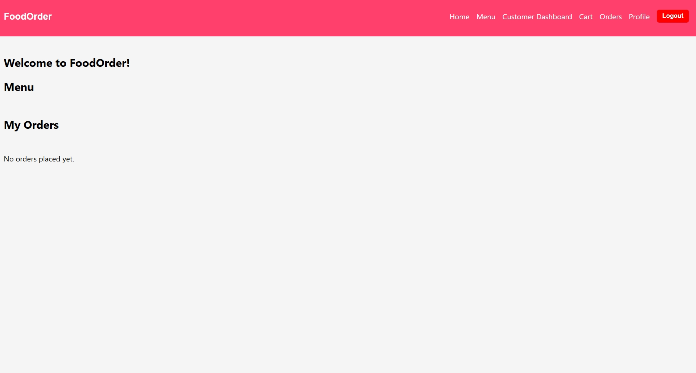

# Food Order–Delivery System

## Project Overview

The Food Order–Delivery System allows customers to order food from registered vendors, track orders in real-time, make secure payments, and leave reviews. Vendors can manage menus, view and update orders, and respond to customer feedback. The system includes notifications and delivery status simulation for a smooth ordering experience.


## Objectives

1. Vendor Onboarding & Management

   * Register and manage profile, update menus, prices, and availability
2. User-Centric Ordering System

   * Browse menus, place food orders, customize items
3. Order Delivery & Tracking

   * Real-time order progress simulation with status updates
4. Secure Payments & Billing

   * Integrate payment gateways (UPI, Paytm, Cards) and generate receipts
5. User Profiles & Order History

   * Manage personal data, addresses, view past orders
6. Review & Feedback System

   * Post-delivery reviews and ratings for vendors and food
7. Admin Panel (Optional)

   * Manage users, vendors, delivery reports, analytics


## Key Features

### Vendor Profile Module

* Registration/login
* Profile creation (name, address, contact, cuisine type, optional certifications)
* Menu management: Add/Edit/Delete items, set prices, images, availability
* View current orders and update status (Preparing, Ready, Delivered)

### Customer Ordering System

* Browse food items by vendor, cuisine, rating, price
* Add items to cart and modify quantities
* View estimated delivery time and item availability
* Place order and confirm address
* Real-time status updates

### Delivery Module

* Assign delivery tasks (mock simulation)
* Track delivery status: Out for delivery, Delivered
* Customers can confirm receipt

### Payments Integration

* Secure payment gateway: UPI, Paytm, Debit/Credit cards, Net Banking
* Invoice generation
* Refund handling

### Customer Profile & Order History

* Registration/login
* Manage addresses, payment methods
* View past orders, reorder, view receipts

### Review & Rating Module

* Rate food items and vendors
* Write text-based reviews
* Vendors can respond to feedback (optional)


## Technologies Used

* Frontend: HTML, CSS, JS, React
* Backend: Node.js with Express
* Database: MongoDB
* Authentication: JWT
* Payment Gateway: Razorpay
* Hosting/Demo: Firebase / Render / Heroku
* Version Control: Git + GitHub


## Setup Instructions

### Backend

1. Navigate to the backend folder:

```bash
cd backend
```

2. Install dependencies:

```bash
npm install
```

3. Create `.env` file:

```ini
MONGO_URI=<your_mongodb_connection_string>
JWT_SECRET=<your_secret>
PORT=5000
```

4. Start backend server:

```bash
npm run dev
```

### Frontend

1. Navigate to the frontend folder:

```bash
cd frontend
```

2. Install dependencies:

```bash
npm install
```

3. Start frontend:

```bash
npm start
```

## Here are some screenshots 

## Screenshots

### Home Page

*Customer-facing homepage displaying vendors, cuisine filters, and search functionality.*

### Vendor Dashboard

*Vendor dashboard for managing profile, menu, and viewing orders.*

### Menu & Order Placement


*Customer browsing vendor menu, adding items to cart, and placing orders.*


