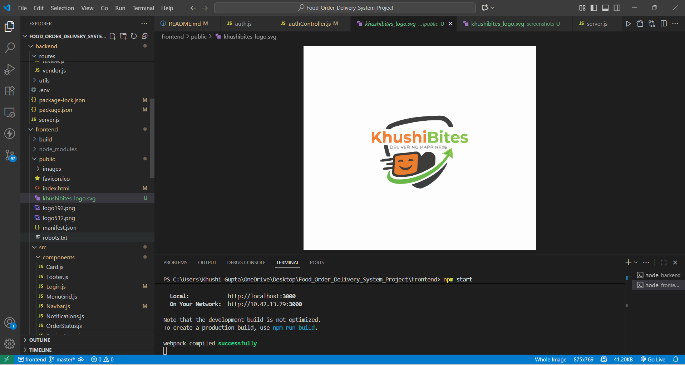

# KhushiBites: Food Order Delivery System 🍔🛵


An academic project for a full-stack food ordering and delivery platform, providing a seamless experience for both vendors and customers.

## Project Overview
This system enables users to order food from registered vendors, track their orders in real-time, make secure payments (mock implementation), and provide reviews. Vendors can manage their menu, track incoming orders, and update order status efficiently. The system also simulates delivery flow and notifications using Socket.IO.

## Badges


## Features

### Vendor Module
- Vendor registration/login with JWT authentication.
- Create and manage profile: name, address, contact, cuisine type.
- Menu management:
  - Add/Edit/Delete food items.
  - Set item prices, images, and availability.
- View current orders and update status: Ordered → Preparing → Out for Delivery → Delivered.
- Real-time notifications for new orders via Socket.IO.

### Customer Module
- Customer registration/login.
- Browse food items by vendor, cuisine, rating, or price.
- Add items to cart and modify quantities.
- Checkout with mock payment simulation.
- Track order status in real-time.
- View order history and reorder past meals.
- Rate and review completed orders.

### Real-Time Order Tracking
- Live order status updates for both vendors and customers using Socket.IO.
- Notification system for order placement, status changes, and delivery updates.

### Payment (Mock)
- Simulated payment gateway (Razorpay/UPI).
- Payment status is reflected in the order as `Paid` or `Pending`.
- Real integration can be added later.

### Optional / Advanced Features
- Admin dashboard (not implemented in this version).
- Delivery tracking simulation (basic).
- Invoice generation (order summary provided in UI).


## Tech Stack

| Layer          | Technologies                             |
|----------------|------------------------------------------|
| Frontend       | React.js, HTML, CSS, JS                  |
| Backend        | Node.js, Express                         |
| Database       | MongoDB                                  |
| Authentication | JWT (JSON Web Tokens)                    |
| Real-Time      | Socket.IO                                |
| Hosting        | Local / Render / Railway /Firebase (demo)|
| Version Control| Git & GitHub                    |


## Folder Structure

KhushiBites-Food-Order-Delivery-System
│
├─ backend/
│  ├─ controllers/        # API controllers
│  ├─ models/             # MongoDB schemas
│  ├─ routes/             # Express routes
│  │
│  ├─ middleware/         # Middleware functions
│  │
│  ├─ utils/              # Utility functions
│  │
│  ├─ node_modules/       # Installed npm packages
│  ├─ config.js           # DB & environment config
│  └─ server.js           # Backend entry point
│
├─ frontend/
│  ├─ public/             # Static files (index.html, favicon, etc.)
│  ├─ build/              # Production build folder
│  ├─ node_modules/       # Installed npm packages
│  ├─ src/
│  │  ├─ components/      # Reusable React components
│  │  │
│  │  ├─ pages/           # React pages
│  │  ├─ services/        # API calls using Axios
│  │  │
│  │  └─ App.js           # React main entry point
│  │
├─ screenshots/           # Project screenshots for documentation
└─ README.md              # Project overview, setup instructions, screenshots


## Setup Instructions

### 🚀 Getting Started

Follow these steps to set up and run the project locally.

#### **Backend**

1.  Navigate to the `backend` folder:
    ```bash
    cd backend
    ```

2.  Install dependencies:
    ```bash
    npm install
    ```

3.  Create a `.env` file in the `backend` directory with the following variables:
    ```
    PORT=5000
    MONGO_URI=<your_mongodb_connection_string>
    JWT_SECRET=<your_jwt_secret>
    ```

4.  Start the server:
    ```bash
    npm run dev
    ```


#### **Frontend**

1.  Navigate to the `frontend` folder:
    ```bash
    cd frontend
    ```

2.  Install dependencies:
    ```bash
    npm install
    ```

3.  Create a `.env` file in the `frontend` directory:
    ```
    REACT_APP_API_URL=http://localhost:5000
    ```

4.  Start the React app:
    ```bash
    npm start
    ```


### 📝 Usage

#### **Vendor**

* Register or login as a vendor.
* Add, edit, or delete menu items.
* View incoming orders and update their status in real-time.

#### **Customer**

* Register or login as a customer.
* Browse vendors, add items to a cart, and proceed to checkout (mock payment).
* Track order progress and provide reviews.

#### **Order Tracking**

* Both vendors and customers receive real-time notifications for order updates using **Socket.IO**.

---

### ⚠️ Notes

* Payment integration is currently mocked for testing purposes. Real integrations (e.g., Razorpay, UPI) can be added in the backend.
* An admin panel is optional and not included in this version.
* Delivery tracking is simulated; real map integration is not implemented.


### 📸 Screenshots

**Backend Setup**


**Frontend Setup**


**Home Page**


**Vendor Home Page**


**Vendor Dashboard**


**Vendor Orders**


**Vendor Cart**


### ✍️ Authors

* **Khushi Gupta** – IIT Guwahati
    * Email: khushigupta2590@gmail.com
    * GitHub: https://github.com/KhushiGupta13

### 📄 License

This project is for academic purposes and evaluation.